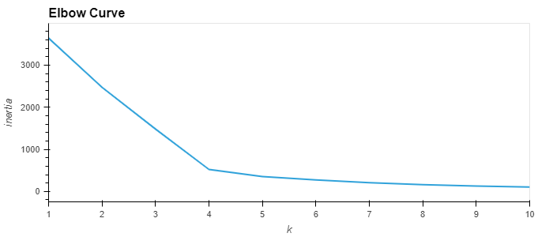
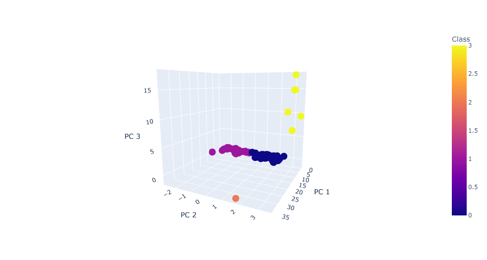
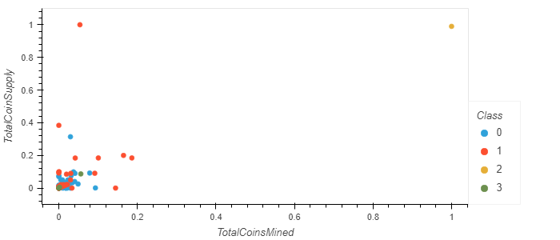

# Cryptocurrencies

## Overview

Using unsupervised machine learning algorithms, attempt to cluster and classify different types of cryptocurrencies currently available on the trading market.

## Software and Data Sources

### Software

The analysis made use of the following software:
- Python
  - hvPlot
  - Pandas
  - path
  - Plotly Express
  - scikit-learn
    - cluster
    - decomposition
    - preprocessing

### Data Source

[The data used in this analysis](./Resources/crypto_data.csv) was collected from [CryptoCompare](https://min-api.cryptocompare.com/data/all/coinlist).

## Analysis

Using Pandas, the data was processed and filtered, leaving 532 tradable cryptocurrencies remaining for analysis, the features of which were combined using [principal component analysis (PCA)](https://builtin.com/data-science/step-step-explanation-principal-component-analysis) to project them onto a three-dimensional subspace in order to facilitate visualization (and faster machine classification).

This compressed data was then subjected to [k-means clustering](https://www.learnbymarketing.com/methods/k-means-clustering/) for several `k`-values, which produced the following [elbow curve](https://en.wikipedia.org/wiki/Elbow_method_(clustering)):

The elbow curve suggested an elbow point at four (4), and so the data was then classified into four classes. The results can be seen in the following graph:

Each currency was also plotted on a graph according to its relative (on a 0-to-1 scale) total coin supply vs. total number of coins mined. The graph can be seen below:

## Results

The vast majority of the currencies were assigned to two classes. Those two classes' clusters are all located near the origin points of each of the two graphs shown above.

## Summary

The cryptocurrencies classified into classes 2 and 3 in the above data have their points far removed from the others in the above graphs. Their presence may make the overall trends and clusters for the others more difficult to see.

It might be worthwhile to perform the analyses again, but with those currencies removed, to see if any new insight can be gained from the reclassification of the other currencies.